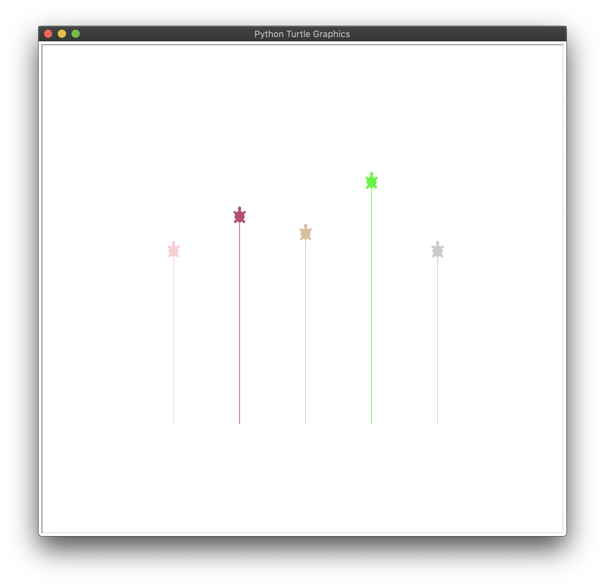

# python-turtle

A basic python project with the turtle module

## Getting Started

These instructions will get you a copy of the project up and running on your local machine for testing purposes.

### Prerequisites

- A working command line

### Installing and Running

Download the zip and run the program via the command line

Examples

## Authors

* **Michael Roush** - *Project completion*

## License

Copyright © 2020 Michael Roush. All rights reserved.

